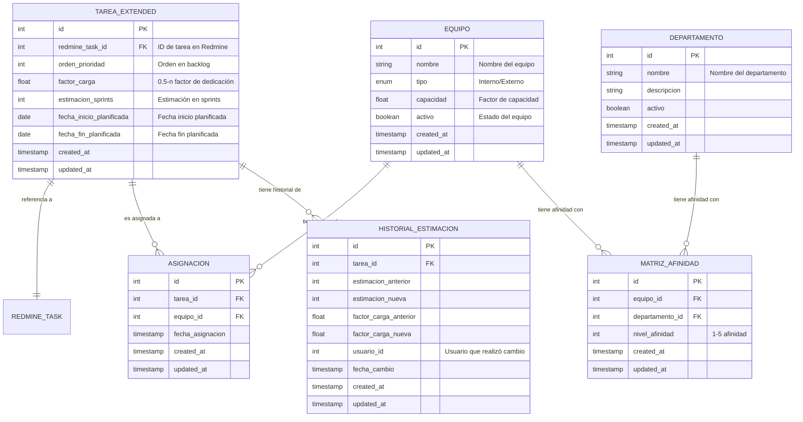

# Modelo de Datos - TaskDistributor (MVP)

## 1. Diagrama del Modelo de Datos

## 2. Descripción de Entidades

### 2.1. TAREA_EXTENDED
Almacena la información adicional de tareas que no existe en Redmine.

| Atributo | Tipo | Descripción | Restricciones |
|----------|------|-------------|---------------|
| id | INT | Identificador único de la tarea extendida | PK, NOT NULL, AUTO_INCREMENT |
| redmine_task_id | INT | Referencia al ID de la tarea en Redmine | FK, NOT NULL, UNIQUE |
| orden_prioridad | INT | Posición en el backlog para priorización | DEFAULT NULL |
| factor_carga | FLOAT | Valor que indica la carga de trabajo necesaria (0.5-n) | DEFAULT 1.0 |
| estimacion_sprints | INT | Número de sprints estimados para completar la tarea | DEFAULT NULL |
| fecha_inicio_planificada | DATE | Fecha planificada de inicio | DEFAULT NULL |
| fecha_fin_planificada | DATE | Fecha planificada de finalización | DEFAULT NULL |
| created_at | TIMESTAMP | Fecha y hora de creación del registro | NOT NULL |
| updated_at | TIMESTAMP | Fecha y hora de última actualización | NOT NULL |

**Relaciones:**
- Se relaciona con ASIGNACION (1:N): Una tarea puede tener múltiples asignaciones históricas
- Se relaciona con HISTORIAL_ESTIMACION (1:N): Una tarea puede tener múltiples entradas de historial

### 2.2. EQUIPO
Almacena información sobre los equipos de desarrollo disponibles.

| Atributo | Tipo | Descripción | Restricciones |
|----------|------|-------------|---------------|
| id | INT | Identificador único del equipo | PK, NOT NULL, AUTO_INCREMENT |
| nombre | VARCHAR(100) | Nombre del equipo | NOT NULL, UNIQUE |
| tipo | ENUM | Tipo de equipo (Interno/Externo) | NOT NULL |
| capacidad | FLOAT | Factor numérico que representa la capacidad del equipo | NOT NULL, DEFAULT 1.0 |
| activo | BOOLEAN | Indica si el equipo está activo | NOT NULL, DEFAULT TRUE |
| created_at | TIMESTAMP | Fecha y hora de creación del registro | NOT NULL |
| updated_at | TIMESTAMP | Fecha y hora de última actualización | NOT NULL |

**Relaciones:**
- Se relaciona con ASIGNACION (1:N): Un equipo puede tener múltiples tareas asignadas
- Se relaciona con MATRIZ_AFINIDAD (1:N): Un equipo puede tener afinidad con múltiples departamentos

### 2.3. DEPARTAMENTO
Almacena información sobre los departamentos de negocio.

| Atributo | Tipo | Descripción | Restricciones |
|----------|------|-------------|---------------|
| id | INT | Identificador único del departamento | PK, NOT NULL, AUTO_INCREMENT |
| nombre | VARCHAR(100) | Nombre del departamento | NOT NULL, UNIQUE |
| descripcion | TEXT | Descripción detallada del departamento | DEFAULT NULL |
| activo | BOOLEAN | Indica si el departamento está activo | NOT NULL, DEFAULT TRUE |
| created_at | TIMESTAMP | Fecha y hora de creación del registro | NOT NULL |
| updated_at | TIMESTAMP | Fecha y hora de última actualización | NOT NULL |

**Relaciones:**
- Se relaciona con MATRIZ_AFINIDAD (1:N): Un departamento puede tener afinidad con múltiples equipos

### 2.4. MATRIZ_AFINIDAD
Establece la relación de afinidad entre equipos y departamentos para el sistema de recomendación.

| Atributo | Tipo | Descripción | Restricciones |
|----------|------|-------------|---------------|
| id | INT | Identificador único | PK, NOT NULL, AUTO_INCREMENT |
| equipo_id | INT | Referencia al equipo | FK, NOT NULL |
| departamento_id | INT | Referencia al departamento | FK, NOT NULL |
| nivel_afinidad | INT | Valor numérico (1-5) que indica el nivel de afinidad | NOT NULL, DEFAULT 1 |
| created_at | TIMESTAMP | Fecha y hora de creación del registro | NOT NULL |
| updated_at | TIMESTAMP | Fecha y hora de última actualización | NOT NULL |

**Restricciones:**
- UNIQUE (equipo_id, departamento_id): Un equipo solo puede tener un nivel de afinidad definido con un departamento específico
- CHECK (nivel_afinidad BETWEEN 1 AND 5): El nivel de afinidad debe estar entre 1 y 5

### 2.5. ASIGNACION
Registra la asignación de tareas a equipos, manteniendo un historial de asignaciones.

| Atributo | Tipo | Descripción | Restricciones |
|----------|------|-------------|---------------|
| id | INT | Identificador único | PK, NOT NULL, AUTO_INCREMENT |
| tarea_id | INT | Referencia a la tarea extendida | FK, NOT NULL |
| equipo_id | INT | Referencia al equipo asignado | FK, NOT NULL |
| fecha_asignacion | TIMESTAMP | Fecha y hora de cuando se realizó la asignación | NOT NULL |
| created_at | TIMESTAMP | Fecha y hora de creación del registro | NOT NULL |
| updated_at | TIMESTAMP | Fecha y hora de última actualización | NOT NULL |

### 2.6. HISTORIAL_ESTIMACION
Almacena el historial de cambios en estimaciones y factores de carga para auditoría y seguimiento.

| Atributo | Tipo | Descripción | Restricciones |
|----------|------|-------------|---------------|
| id | INT | Identificador único | PK, NOT NULL, AUTO_INCREMENT |
| tarea_id | INT | Referencia a la tarea extendida | FK, NOT NULL |
| estimacion_anterior | INT | Valor de estimación antes del cambio | DEFAULT NULL |
| estimacion_nueva | INT | Valor de estimación después del cambio | DEFAULT NULL |
| factor_carga_anterior | FLOAT | Valor de factor de carga antes del cambio | DEFAULT NULL |
| factor_carga_nueva | FLOAT | Valor de factor de carga después del cambio | DEFAULT NULL |
| usuario_id | INT | ID del usuario que realizó el cambio | NOT NULL |
| fecha_cambio | TIMESTAMP | Fecha y hora del cambio | NOT NULL |
| created_at | TIMESTAMP | Fecha y hora de creación del registro | NOT NULL |
| updated_at | TIMESTAMP | Fecha y hora de última actualización | NOT NULL |

## 3. Notas de Implementación

1. **Referencia a Redmine**: La entidad TAREA_EXTENDED se relaciona con las tareas de Redmine solo mediante el ID externo, evitando duplicar información.

2. **Timestamps**: Todos los modelos incluyen campos de auditoría created_at y updated_at para seguimiento de cambios.

3. **Soft Delete**: Para entidades como EQUIPO y DEPARTAMENTO, se utiliza un campo 'activo' para realizar eliminación lógica en lugar de física.

4. **Integridad Referencial**: Se deben implementar restricciones de clave foránea apropiadas para todas las relaciones, con políticas de CASCADE o RESTRICT según el caso.

5. **Índices**: Además de las claves primarias, se recomienda crear índices en:
   - redmine_task_id en TAREA_EXTENDED
   - equipo_id y tarea_id en ASIGNACION
   - equipo_id y departamento_id en MATRIZ_AFINIDAD

Este modelo de datos simplificado está centrado en las entidades fundamentales para el MVP de TaskDistributor, permitiendo gestionar las tareas, equipos, departamentos y sus relaciones sin incluir funcionalidades avanzadas como alertas o filtros personalizados que pueden ser implementados en etapas posteriores. 