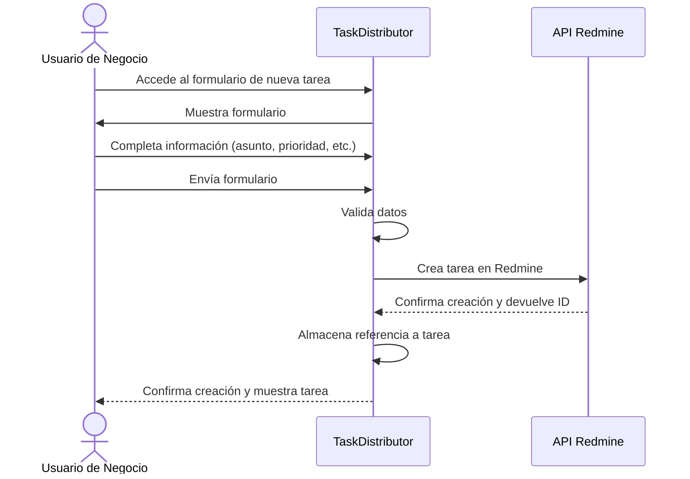
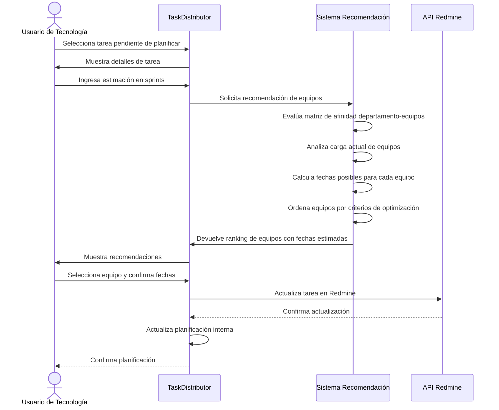
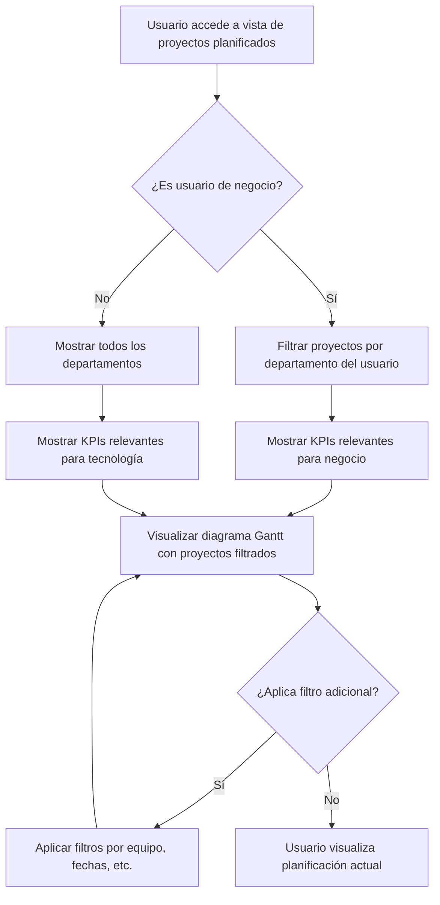
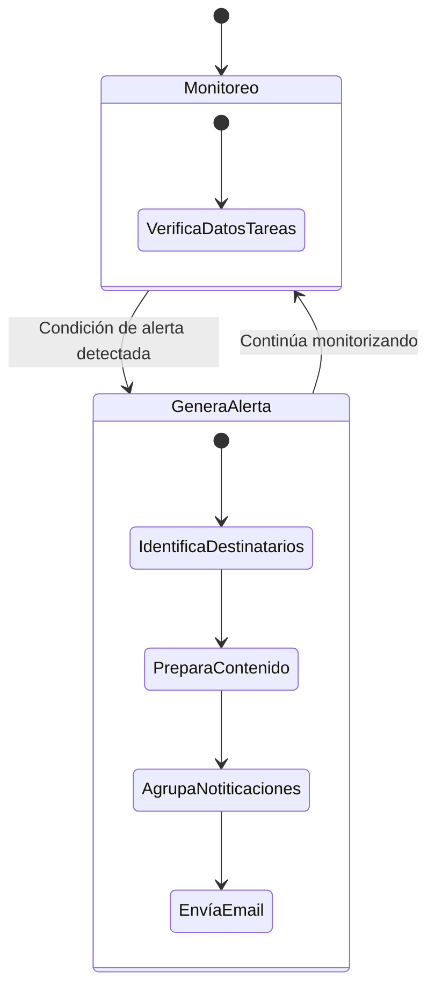
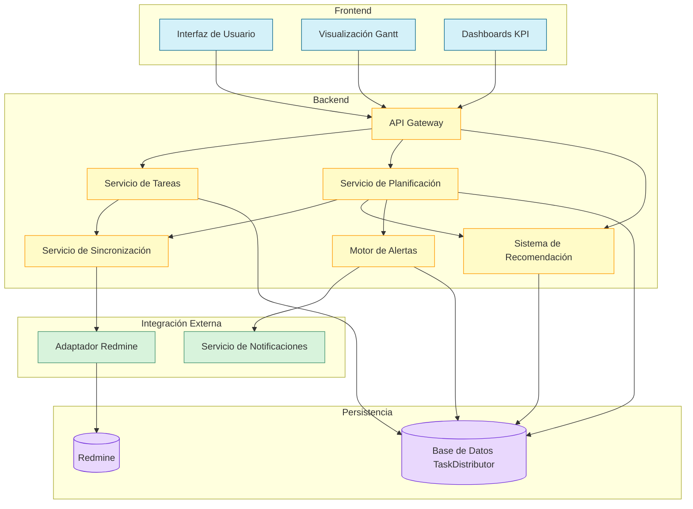

# Diseño del Sistema TaskDistributor

## 1. Descripción del Software

TaskDistributor es una herramienta de gestión y planificación de proyectos de tecnología diseñada para mejorar la visibilidad y optimizar la asignación de recursos entre equipos de desarrollo. Integrada con Redmine, esta solución centraliza la gestión de tareas proporcionando una interfaz intuitiva tanto para equipos de negocio como de tecnología.

### Valor Añadido y Ventajas Competitivas

- **Asignación Inteligente**: Sistema de recomendación basado en algoritmos que sugiere el equipo óptimo para cada tarea considerando capacidad, experiencia y afinidad departamental.
- **Visibilidad en Tiempo Real**: Visualización mediante gráficos Gantt y KPIs que permiten entender el estado actual de proyectos y recursos.
- **Gestión Proactiva**: Sistema de alertas automatizadas que notifica sobre tareas pendientes, fechas críticas y necesidades de planificación.
- **Integración Completa**: Sincronización bidireccional con Redmine manteniendo la consistencia de datos y aprovechando las herramientas existentes.
- **Experiencia Diferenciada**: Interfaces adaptadas según rol (negocio o tecnología) que simplifican los flujos de trabajo específicos.

### Funciones Principales

1. **Gestión centralizada de tareas** con sincronización automática con Redmine
2. **Sistema inteligente de recomendación** para asignación óptima de equipos a tareas
3. **Visualización de planificación** mediante gráficos Gantt y KPIs personalizados
4. **Notificaciones automáticas** para gestión proactiva de proyectos
5. **Gestión de capacidades** de equipos internos y externos

### Lean Canvas

```mermaid
graph TD
    subgraph "Lean Canvas - TaskDistributor"
    
    A[Problema<br/>- Falta de visibilidad en estado de tareas<br/>- Planificación sin visión global<br/>- Deficiente actualización de tareas<br/>- Cambios constantes de prioridades]
    
    B[Solución<br/>- Sistema de recomendación<br/>- Visualización en tiempo real<br/>- KPIs relevantes<br/>- Sistema de alertas]
    
    C[Propuesta de Valor<br/>- Planificación de proyectos ágil y centralizada<br/>- Visibilidad compartida entre negocio y tecnología<br/>- Optimización en asignación de recursos<br/>- Mejora en estimaciones y cumplimiento de plazos]
    
    D[Ventaja Especial<br/>- Integración con sistemas existentes<br/>- Algoritmo de recomendación adaptado<br/>- Experiencia diferenciada por rol]
    
    E[Segmentos de Cliente<br/>- Departamento de tecnología<br/>- Áreas de negocio<br/>- Equipos de desarrollo internos<br/>- Equipos de desarrollo externos]
    
    F[Métricas Clave<br/>- Precisión de recomendaciones<br/>- Reducción de tiempos de planificación<br/>- Cumplimiento de fechas estimadas<br/>- Nivel de utilización de equipos]
    
    G[Canales<br/>- Aplicación web interna<br/>- Notificaciones por email<br/>- Integración con Redmine<br/>- Informes periódicos]
    
    H[Estructura de Costes<br/>- Desarrollo inicial<br/>- Mantenimiento y mejoras<br/>- Integración con sistemas existentes<br/>- Formación a usuarios]
    
    I[Fuentes de Ingresos<br/>- Reducción costes de gestión<br/>- Optimización asignación recursos<br/>- Mejora en entregas a tiempo<br/>- Aumento satisfacción clientes]
    
    end
```

## 2. Casos de Uso Principales

### CU-01: Creación de Tarea por Usuario de Negocio

### CU-02: Planificación y Asignación de Tarea por Usuario de Tecnología

### CU-03: Visualización de Tareas Planificadas

### CU-04: Sistema de Alertas Automáticas

## 3. Diseño del Sistema a Alto Nivel

TaskDistributor está diseñado como una aplicación web que se integra con Redmine a través de su API, manteniendo su propia base de datos para la gestión de planificación y recomendaciones. La arquitectura sigue un patrón de microservicios para mantener separadas las diferentes funcionalidades.

### Componentes Principales:

1. **Frontend**: Interfaz de usuario adaptada a roles (negocio/tecnología) desarrollada con React y Bootstrap (principalmente), que proporciona diferentes vistas para la gestión y visualización de tareas (gráficos Gantt y representaciones visuales de KPIs).

2. **Backend API**: Servicio RESTful implementado con Node (Express) que maneja la lógica de negocio, autenticación y coordina la comunicación entre componentes. Además se encarga de la implementación de algoritmos para recomendar equipos de desarrollo basándose en múltiples factores, componente de comunicación con el API de redmine y capa de gestión de alertas.

3. **Base de Datos Operacional**: Almacena la información específica de planificación, matrices de afinidad, y datos auxiliares no presentes en Redmine.

### Diagrama de Arquitectura:

### Flujo de Datos Principal:

1. **Creación de Tareas**: 
   - Los usuarios de negocio crean tareas a través de la interfaz
   - El servicio de tareas las valida y las envía al adaptador Redmine
   - Redmine almacena la tarea y devuelve el identificador
   - TaskDistributor almacena la referencia y datos adicionales

2. **Planificación de Tareas**:
   - Los usuarios de tecnología seleccionan tareas pendientes
   - Proporcionan estimaciones en sprints
   - El sistema de recomendación evalúa equipos y propone asignaciones
   - Al confirmar, se actualiza la planificación en TaskDistributor y Redmine

3. **Visualización**:
   - El servicio de visualización genera gráficos Gantt basados en datos planificados
   - Los KPIs se calculan en tiempo real según la información disponible
   - La interfaz muestra diferentes vistas según el rol del usuario

4. **Alertas**:
   - El motor de alertas monitorea continuamente el estado de tareas
   - Cuando se cumplen condiciones de alerta, se generan notificaciones
   - El servicio de notificaciones envía emails a los destinatarios correspondientes

Esta arquitectura garantiza:
- **Escalabilidad**: Los componentes pueden escalar independientemente
- **Mantenibilidad**: Separación clara de responsabilidades
- **Flexibilidad**: Facilidad para modificar o reemplazar componentes
- **Integración**: Comunicación eficiente con sistemas existentes
- **Rendimiento**: Optimización para operaciones críticas como visualización y recomendación
